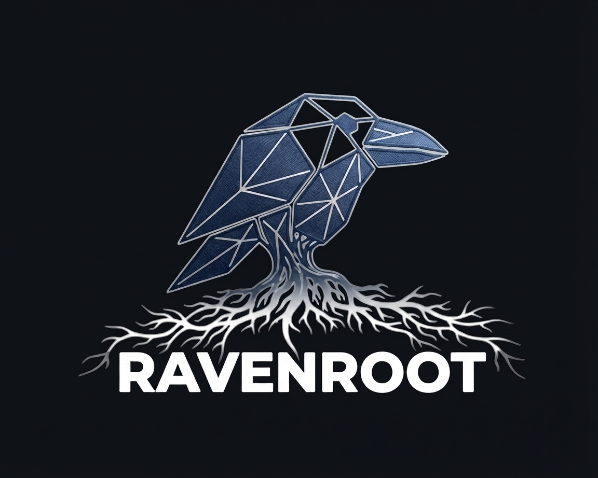
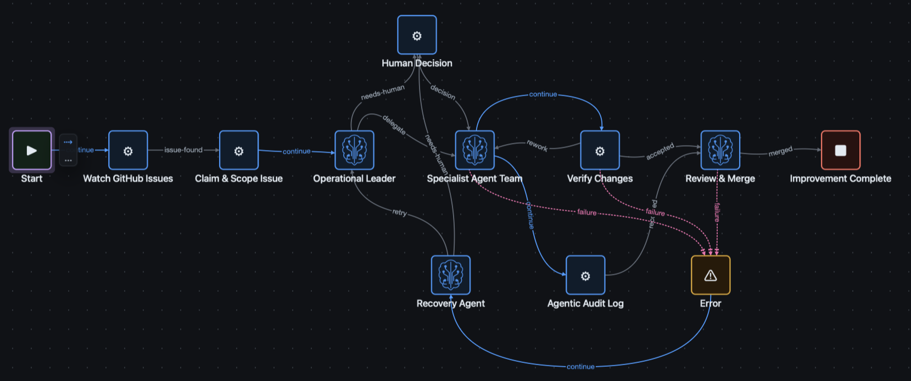
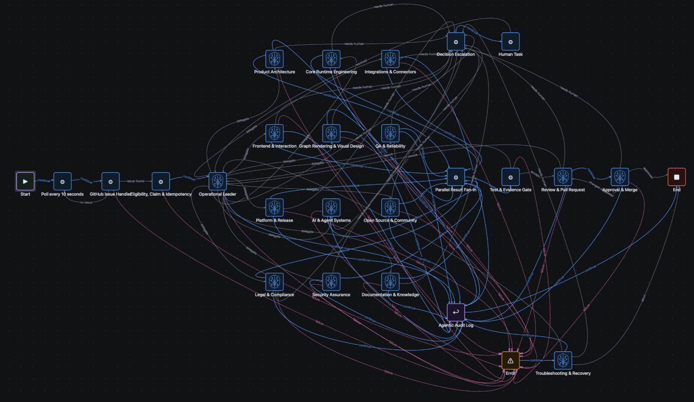

<p align="center">
  
</p>

<h1 align="center">Ravenroot</h1>

<p align="center">
  <strong>Turn visual graph intent into programmable, observable backend workflows.</strong>
</p>

<p align="center">
  <a href="https://ravenroot.ai">Website</a> ·
  <a href="https://github.com/ravenroot-ai/ravenroot/releases">Releases</a> ·
  <a href="https://docs.ravenroot.ai/">Documentation</a> ·
  <a href="https://github.com/ravenroot-ai/ravenroot/issues">Issues</a>
</p>

Ravenroot is a graph-governed orchestration platform for personal and operational automation,
backend and business workflows, APIs, and services. A graph is the executable structure of the
application: nodes do work, edges express outcomes and routing, and the runtime preserves the
policies, correlation, and activity needed to understand every execution.

Design workflows visually, extend them with code or installable node packages, and run the same
GraphML definition through an embedded Java library or the standalone server, browser workspace,
CLI, and HTTP API.



*A Ravenroot-rendered view of a self-improving software-delivery workflow, making decisions,
handoffs, verification, recovery, and audit paths explicit.*

## What you can build

- **Integration workflows.** Connect messaging, HTTP and OpenAPI services, WebSockets, mailboxes,
  JDBC databases, approved filesystem roots, and S3-compatible object storage through installable
  node packages.
- **Data and decision flows.** Parse and select JSON, render templates, transform or route values,
  branch on outcomes, fan out work, join correlated paths, and introduce controlled delays.
- **Programmable workflows.** Promote reviewed artifacts through a managed lifecycle and execute
  supported JavaScript or Python nodes behind an operator-provided sandbox boundary.
- **Governed AI flows.** Add model-backed prompt and bounded agent nodes as explicit plugins, then
  place them inside graph-defined service grants, budgets, routing, and human-review steps. The
  operator selects and configures each provider.
- **Observable services.** Follow correlated runtime activity in the browser, over Server-Sent
  Events, in structured logs, or through the optional OpenTelemetry bridge.

Node packages keep protocol-specific capabilities separate from the runtime core. A deployment can
install the integrations it needs while preserving consistent graph, payload, execution, and
security contracts. See [nodes, plugins, and runtime adapters](docs/integrator-guide/extensions-adapters.md).

## Run Ravenroot your way

| Shape | Best for | Entry point |
|---|---|---|
| Embedded Java | Applications that own composition, identity, and lifecycle | `ravenroot-core` with an execution-engine adapter such as `ravenroot-pekko` |
| Standalone JAR or ZIP | A self-contained server, workspace, CLI, and API | [GitHub Releases](https://github.com/ravenroot-ai/ravenroot/releases) |
| Container | Repeatable server and browser-workspace deployments | [GitHub Container Registry](https://github.com/orgs/ravenroot-ai/packages/container/package/ravenroot) |

## Quick start

### Embed Ravenroot in a JVM application

Use the core runtime with an execution-engine adapter discovered at runtime. The first public alpha
coordinates are:

```xml
<dependencies>
  <dependency>
    <groupId>ai.ravenroot</groupId>
    <artifactId>ravenroot-core</artifactId>
    <version>0.1.0-alpha.1</version>
  </dependency>
  <dependency>
    <groupId>ai.ravenroot</groupId>
    <artifactId>ravenroot-pekko</artifactId>
    <version>0.1.0-alpha.1</version>
    <scope>runtime</scope>
  </dependency>
</dependencies>
```

Check [Maven Central](https://central.sonatype.com/search?q=ai.ravenroot) for published versions.
The [integrator guide](docs/integrator-guide/index.md) describes application composition, HTTP and
SSE integration, plugins, adapters, programmable artifacts, and model-backed nodes.

### Run the standalone distribution

Choose a JAR or ZIP from [GitHub Releases](https://github.com/ravenroot-ai/ravenroot/releases), or
select a published tag or digest from the
[container registry](https://github.com/orgs/ravenroot-ai/packages/container/package/ravenroot).
Continue with [Install and start Ravenroot](docs/get-started/install-start.md), then
[build your first graph](docs/get-started/first-graph.md) and
[run and inspect it](docs/get-started/first-execution.md).

## Server API

The standalone distribution serves the workspace and a versioned HTTP API from the same origin.
Use the API to manage GraphML, discover the active node catalog, start and inspect executions, and
subscribe to correlated execution events. Start with the
[HTTP API and CLI reference](docs/reference/api-cli.md) and use the
[deployment and startup guide](docs/operator-guide/deployment-startup.md) for operational setup.

## From workflow overview to operational detail

The detailed view expands the specialist team into distinct expertise roles and shows explicit
fan-out and fan-in, human decisions, audit, failure routing, recovery, independent review, and merge
paths. It is the same visual orchestration model at a deeper operational resolution.



*A Ravenroot-rendered detailed workflow showing how a compact process can expand into explicit
operational responsibilities and recovery paths.*

## Documentation

- **Workflow authors:** [workspace and graph authoring](docs/user-guide/workspace-authoring.md),
  [payloads, outcomes, and routing](docs/user-guide/payload-routing.md), and
  [node catalog, payloads, and limits](docs/reference/nodes-payload-limits.md)
- **Extension authors:** [nodes, plugins, and runtime adapters](docs/integrator-guide/extensions-adapters.md)
  and [model, agent, and program integration](docs/integrator-guide/ai-programs.md)
- **Application developers:** [application, HTTP, SSE, and CLI integration](docs/integrator-guide/application-http.md),
  [HTTP API and CLI](docs/reference/api-cli.md), and [GraphML profile](docs/reference/graphml.md)
- **Operators:** [deployment and startup](docs/operator-guide/deployment-startup.md),
  [credentials, connectors, and egress](docs/operator-guide/credentials-egress.md), and
  [threat model, identity, and authorization](docs/security/trust-identity.md)
- **Architects and reviewers:** [product boundaries](docs/architecture/product-boundaries.md),
  [architecture and concepts](docs/architecture/index.md), and
  [architecture decision records](adr/README.md)

Browse the complete [Ravenroot documentation](https://docs.ravenroot.ai/).

## Release status

Ravenroot begins its public lifecycle at `0.1.0-alpha.1`. Alpha releases provide an early,
versioned surface for evaluating graph authoring, execution, extension, deployment, and operational
contracts while the project evolves rapidly. Published artifacts and images are identified by an
explicit version or immutable digest.

## Contributing

Bug reports, use cases, documentation improvements, and focused pull requests are welcome. Read
[CONTRIBUTING.md](CONTRIBUTING.md) and open a discussion in the
[issue tracker](https://github.com/ravenroot-ai/ravenroot/issues).

## License

Copyright 2026 Ravenroot contributors.

Ravenroot is licensed under the [Apache License, Version 2.0](LICENSE).
