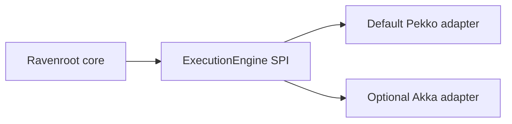

# ADR 0002: Execution-engine abstraction and runtime selection

- Status: Accepted
- Date: 2026-07-20
- Supersedes: Direct coupling between Ravenroot behaviors and actor-framework classes
- Superseded by: None
- Public references: [Execution and actor model](../docs/architecture/execution-actor-model.md), [extension and adapter development](../docs/developer-guide/extension-development.md)

## Context

Ravenroot began with domain behavior classes inheriting actor-framework classes. Selecting another
runtime therefore required changing the domain, and framework types risked becoming public product
contracts.

## Decision

Ravenroot abstracts its execution model rather than either actor library. The application API owns
the execution-engine SPI; the core depends only on that SPI. Runtime adapters translate the SPI to
their framework and are discovered through Java `ServiceLoader`.

Apache Pekko is the default open-source engine in the standard distribution. The Akka adapter is
optional and requires the adopter to supply any repository access and licensing appropriate to the
selected Akka version. Graphs, node behavior contracts, and application APIs are identical across
adapters. Shared conformance tests define mandatory lifecycle and graph-execution behavior.

## Consequences

- Core and application code do not import Pekko or Akka types.
- Runtime-specific clustering, persistence, or scheduling features remain adapter capabilities, not
  assumptions in the portable contract.
- Interchangeability applies to Ravenroot semantics; it does not promise interoperability between
  native actor references, persistence formats, or cluster protocols.
