# Embedded-viewer parity evidence

This page records the public verification surface for the native deployment viewer and the
cross-origin embedded viewer. It is evidence for renderer and authority parity, not a pixel-perfect
requirement: Design and Monitoring deliberately use different geometry.

## Automated coverage

The UI unit suite verifies the versioned viewer envelope, projection allowlist, immutable deployment
binding, lifecycle transitions, bounded reconnect, cursor-gap handling, terminal invalidation, and
shared style semantics. Browser coverage verifies:

- the native **Open read-only view** attachment and the absence of edit or lifecycle commands;
- dark and light rendering for Cyto, N8N, and Elastic in both native and embedded viewers;
- equivalent node identity, labels, bypass state, edge meaning, lifecycle, and runtime-state data;
- cross-origin launch, acknowledgement, projection, and signed observation without cookies;
- no bearer, proof key, cursor, topology, or runtime-event leak through URL, storage, globals, or
  `postMessage`;
- terminal behavior for revocation, replay gap, graph-version/incarnation replacement, and undeploy.

The visual test requires exact semantic presentation equality, enforces a bounded pixel-difference
budget that allows renderer-owned geometry, then saves the rendered native view, embedded view, and
pixel diff for each matrix cell.

The v2 unit matrix covers zero, one, and three authorized selector rows and generation-fenced runtime
reset. Before release, exercise rapid switching, exact-selection refresh, stale version/incarnation,
completion retention, disappearance, revocation, authorization loss, and replay-gap reconciliation.
Also confirm that mode switching preserves each viewport without layout, fit, or simulation and that
Render affects only the selected mode.

The historical image rows below retain their filenames for release continuity. In the public v2 UI,
Cyto is the Design renderer and Elastic is Monitoring; N8N is no longer a public choice. The v2
browser matrix covers Design and Monitoring at desktop and narrow responsive widths in both themes,
including the run selector's zero/one/three states; the committed desktop parity captures follow.

## V2 semantic viewer evidence

| Theme / mode | Native | Embedded | Difference |
|---|---|---|---|
| Dark Design | 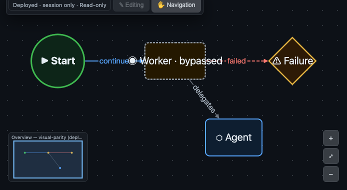 | 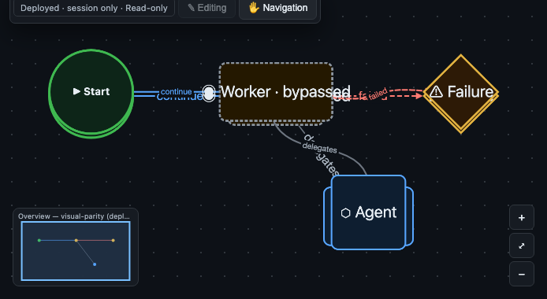 | 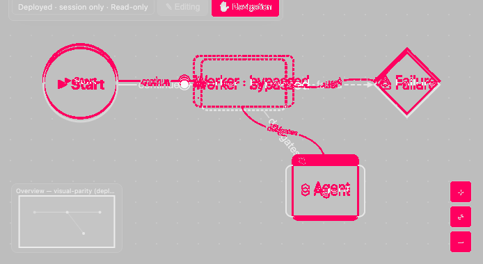 |
| Dark Monitoring | 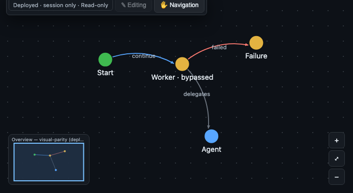 | 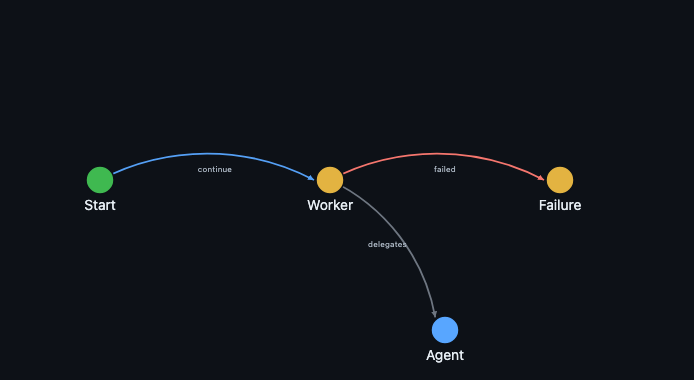 | 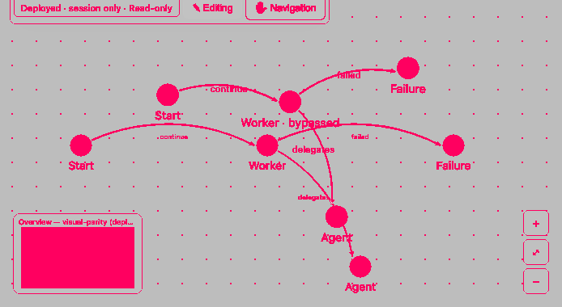 |
| Light Design | 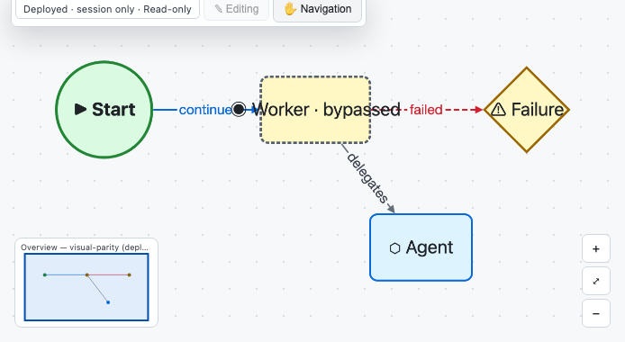 | 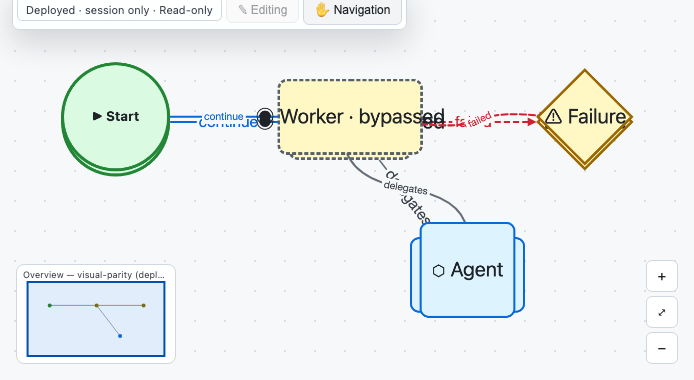 | 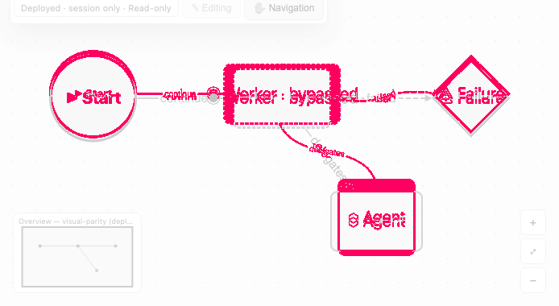 |
| Light Monitoring | 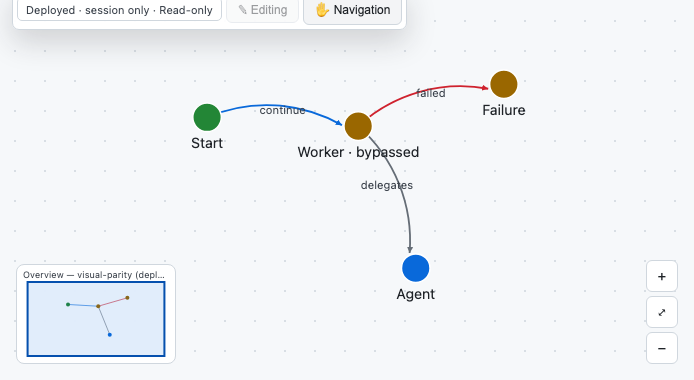 | 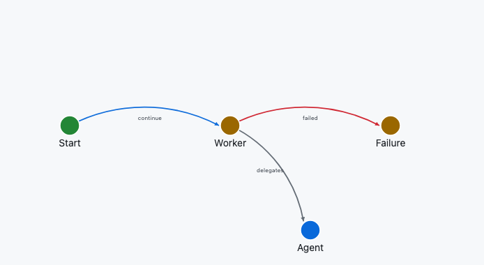 | 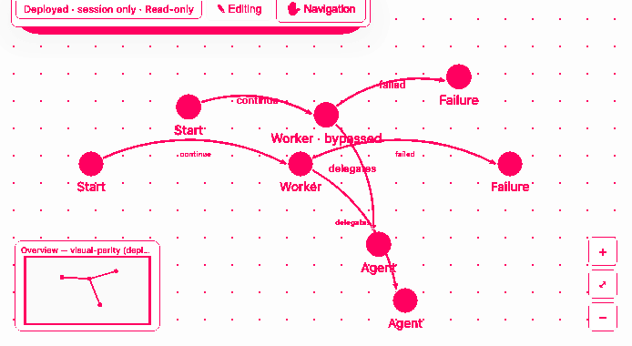 |

## Dark theme

| Mode | Native | Embedded | Difference |
|---|---|---|---|
| Cyto |  |  |  |
| N8N |  |  |  |
| Elastic |  |  |  |

## Light theme

| Mode | Native | Embedded | Difference |
|---|---|---|---|
| Cyto |  |  |  |
| N8N |  |  |  |
| Elastic |  |  |  |

## Reproduce

From `ravenroot/ravenroot-ui`, install the locked dependencies, build the UI, and run:

```console
$ RR_VISUAL_EVIDENCE_DIR=../../docs/qa/evidence/embedded-deployment-viewer \
    npx playwright test e2e/viewer-visual-parity.spec.js
```

For the cross-origin protocol fixture, run `npm run test:browser-embed` after the repository's Java
test classes are available. See the [viewer quickstart](../integrator-guide/embed-viewer-quickstart.md)
for the source and continuity contract.
