# Embedded-viewer parity evidence

This page records the public verification surface for the native deployment viewer and the
cross-origin embedded viewer. It is evidence for renderer and authority parity, not a pixel-perfect
requirement: Cyto, N8N, and Elastic deliberately use different geometry.

## Automated coverage

The UI unit suite verifies the versioned viewer envelope, projection allowlist, immutable deployment
binding, lifecycle transitions, bounded reconnect, cursor-gap handling, terminal invalidation, and
shared style semantics. Browser coverage verifies:

- the native **Open read-only view** attachment and the absence of edit or lifecycle commands;
- dark and light rendering for Cyto, N8N, and Elastic in both native and embedded viewers;
- equivalent node identity, labels, bypass state, edge meaning, lifecycle, and runtime-state data;
- cross-origin launch, acknowledgement, projection, and signed observation without cookies;
- no bearer, proof key, cursor, topology, or runtime-event leak through URL, storage, globals, or
  `postMessage`;
- terminal behavior for revocation, replay gap, graph-version/incarnation replacement, and undeploy.

The visual test requires exact semantic presentation equality, enforces a bounded pixel-difference
budget that allows renderer-owned geometry, then saves the rendered native view, embedded view, and
pixel diff for each matrix cell.

## Dark theme

| Mode | Native | Embedded | Difference |
|---|---|---|---|
| Cyto | 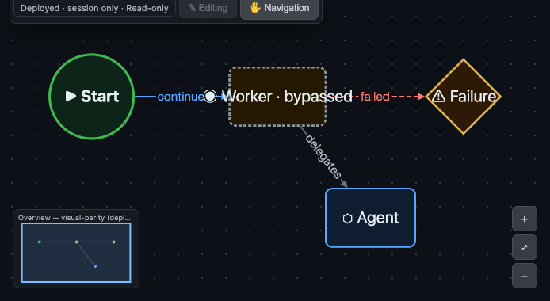 | 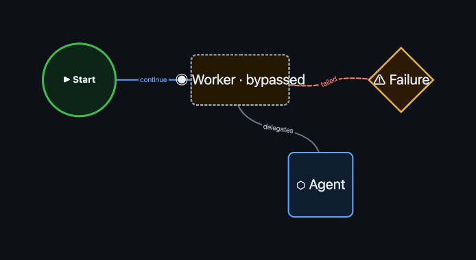 | 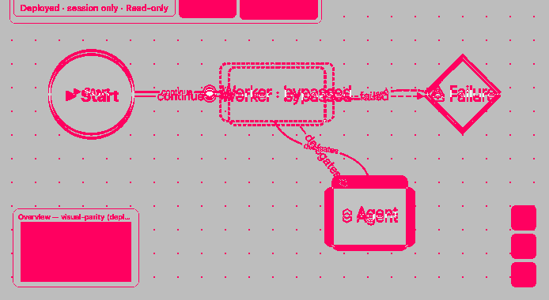 |
| N8N | 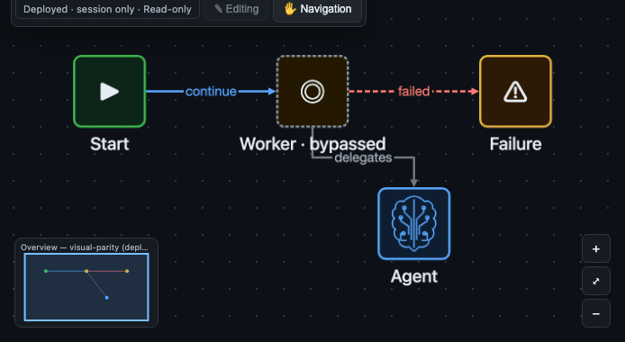 | 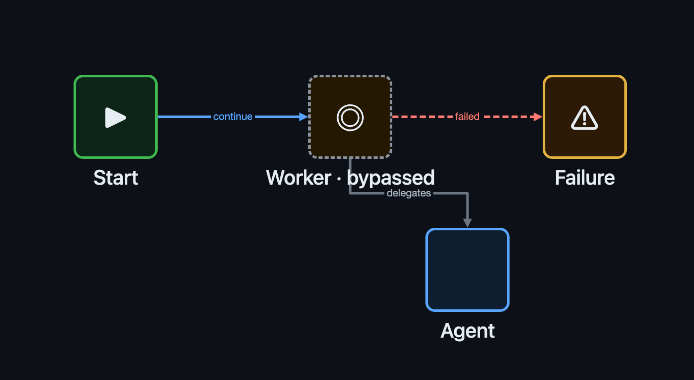 | 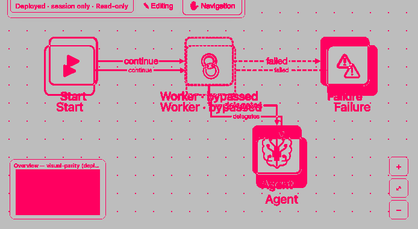 |
| Elastic | 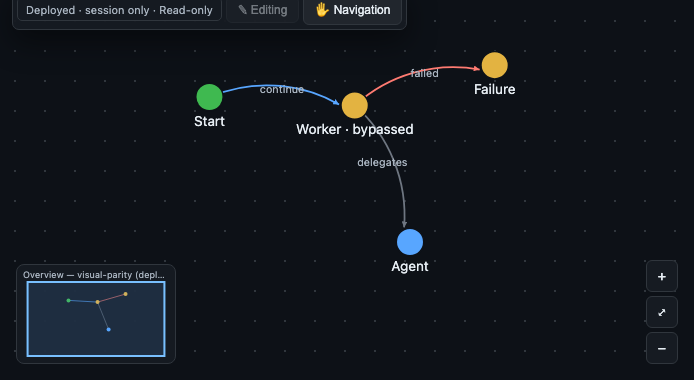 | 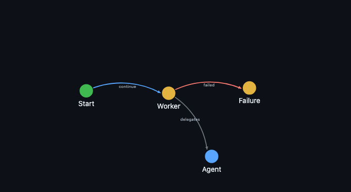 | 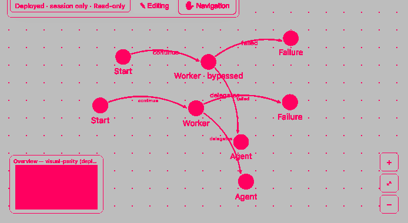 |

## Light theme

| Mode | Native | Embedded | Difference |
|---|---|---|---|
| Cyto | 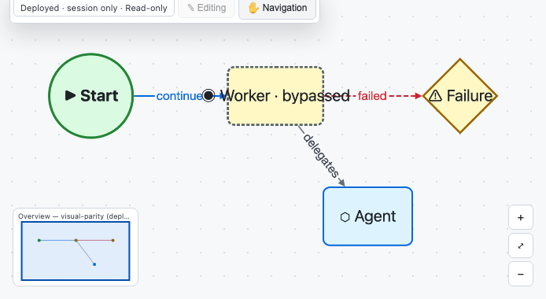 | 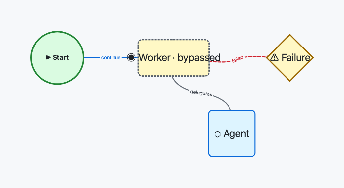 | 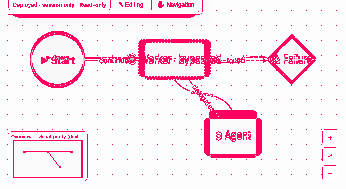 |
| N8N | 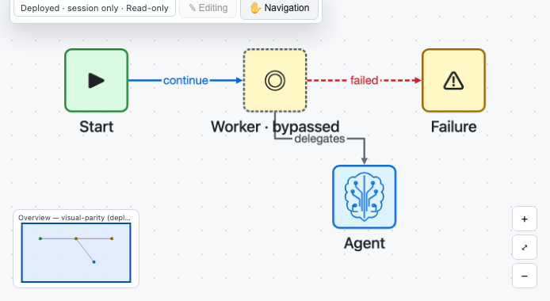 | 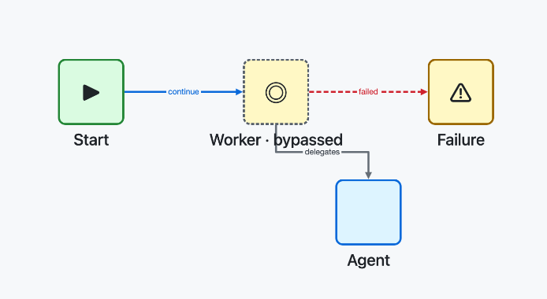 | 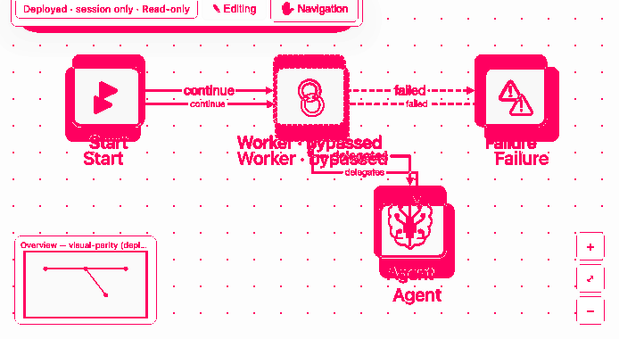 |
| Elastic | 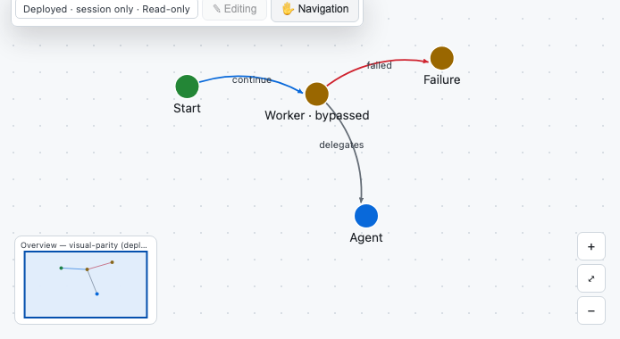 | 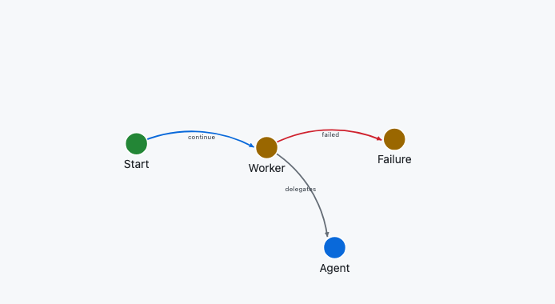 | 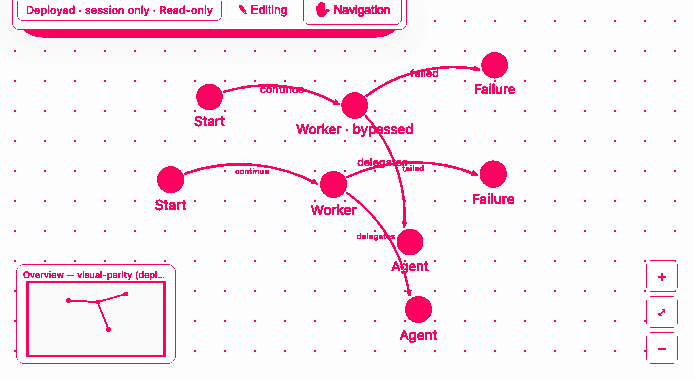 |

## Reproduce

From `ravenroot/ravenroot-ui`, install the locked dependencies, build the UI, and run:

```console
$ RR_VISUAL_EVIDENCE_DIR=../../docs/qa/evidence/embedded-deployment-viewer \
    npx playwright test e2e/viewer-visual-parity.spec.js
```

For the cross-origin protocol fixture, run `npm run test:browser-embed` after the repository's Java
test classes are available. See the [viewer quickstart](../integrator-guide/embed-viewer-quickstart.md)
for the source and continuity contract.
