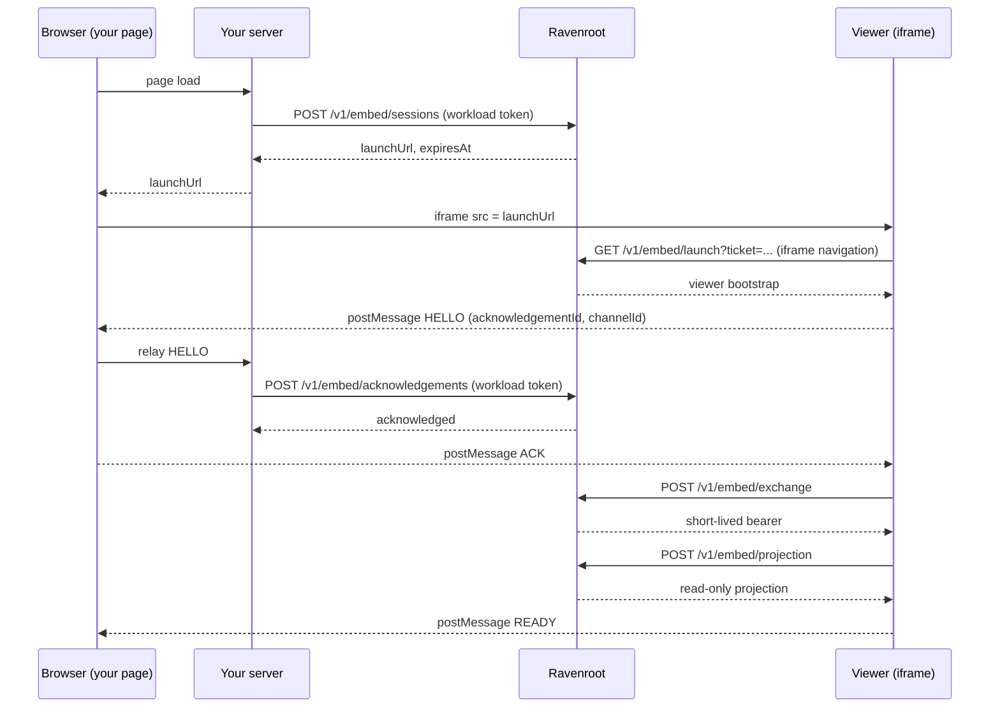

# Embed the read-only viewer: a quickstart

This page takes you from nothing to a Ravenroot graph rendered inside a page you control. Follow it
end to end and you will have a working host page; you do not need to read the source or any other
document first.

## You are embedding the read-only view, not the editor

The embedded viewer **displays a graph. It cannot change one.** It holds read-only projection
authority: it renders a pre-authorized projection and exposes no Modify action, no execution control,
no credential, no adapter, and no operator API. Panning, zooming, switching layout, and reading the
graph contents are the whole of what it does.

There is no embeddable editor. If you are here to put the Ravenroot authoring workspace into another
product, stop: that surface does not exist, and nothing on this page will produce it.

What crosses into your page is a projection of one registered graph version. The graph data itself
never passes through your host page's JavaScript — the viewer fetches it directly, inside its own
frame, on its own origin.

## Three constraints that decide your setup

Read these before you write anything. Each one fails silently or confusingly if you discover it later.

1. **The viewer runs only inside an iframe.** Ravenroot serves the launch only to a request that is
   an iframe navigation, and answers `403 EMBED_SESSION_UNAVAILABLE` to anything else — so opening a
   launch URL in a browser tab returns an error document, not a broken viewer. The viewer's own
   bootstrap enforces the same rule a second time from inside the page, refusing to start when
   `window.parent === window`. Neither refusal explains itself, so recognise the shape.
2. **Both origins must be canonical HTTPS origins, and they must differ.** The viewer's origin and
   your page's origin are `https://host` or `https://host:port` — scheme, host, optional port,
   nothing else. No `http`, not even on loopback; no trailing slash, no path, no explicit `:443`,
   no `*`. The two must also be distinct: your page cannot be served from the viewer's own origin.

   **This is checked when the viewer is used, not when the registration is written.** The deployment's
   own viewer origin is validated at startup, so a bad one stops the server. Your parent origin is
   not: a registration recording `http://app.example.com`, or `https://app.example.com/` with its
   trailing slash, or the viewer's origin repeated, is stored happily and then refuses **every**
   session with `403 EMBED_SESSION_UNAVAILABLE`. Nothing reports the origin as the cause. If a brand
   new registration never produces a launch, compare its origin string against this rule character by
   character before you look anywhere else.
3. **Two of the five endpoints are server-only, by construction.** `/v1/embed/sessions` and
   `/v1/embed/acknowledgements` refuse any request that carries a `Cookie`, an `Origin` header, or
   any `Sec-Fetch-*` header. A browser always sends those, so these calls cannot be made from your
   page even if you tried. They belong to your server, which holds the workload token. The token
   never reaches the browser.

   This bites on the server too: **several HTTP clients add browser metadata headers on their own.**
   Node's global `fetch()` sends `Sec-Fetch-Mode: cors` on every request, so calling either endpoint
   with it returns `400 EMBED_REQUEST_INVALID` no matter how correct your body and token are. Use a
   client that sends only the headers you set — `node:https` below, or `curl` — and if you get a `400`
   you cannot explain, log your outgoing headers before you look anywhere else.

## Before you start

Ask your Ravenroot operator for:

- the **viewer origin** — where the Ravenroot deployment is served, for example
  `https://graphs.example.com`;
- your **registration id** — an opaque identifier for one registered deployment;
- a **workload bearer token** your server can use.

The operator creates the registration, records the seven attestations it requires, and registers your
page's origin as the only origin allowed to frame the viewer. That work is theirs, not yours; see
[Embedded-viewer operations](../operator-guide/embed-operations.md). Give them the exact origin your
host page will be served from — an origin that is not registered cannot frame the viewer, and there
is no way to widen it from your side.

Throughout this page:

- `https://graphs.example.com` is the **viewer origin**;
- `https://app.example.com` is **your** origin, registered as the parent;
- `our-registration` is the registration id.

## How the flow runs



The protocol version is `ravenroot.embed/1`. Every `postMessage` in both directions carries it, and
the viewer ignores any message that does not.

| Endpoint | Method | Called by | Purpose |
|---|---|---|---|
| `/v1/embed/sessions` | POST | **Your server** | Mints a one-use launch URL from a registration id |
| `/v1/embed/launch` | GET | The browser, as an iframe navigation | Consumes the ticket, returns the viewer bootstrap |
| `/v1/embed/acknowledgements` | POST | **Your server** | Vouches for the exact viewer channel before the exchange |
| `/v1/embed/exchange` | POST | The viewer, by itself | Trades the bootstrap challenge for a short-lived bearer |
| `/v1/embed/projection` | POST | The viewer, by itself | Retrieves the read-only projection |

You implement the first and third. The viewer does the rest on its own; you never call `exchange` or
`projection`, and you never see the bearer or the projection.

## Step 1 — your server mints a launch

A launch is one-use and short-lived (60 seconds by default), so mint one per page load rather than
caching it.

```console
$ curl -sS -X POST https://graphs.example.com/v1/embed/sessions \
    -H 'Authorization: Bearer YOUR_WORKLOAD_TOKEN' \
    -H 'Content-Type: application/json' \
    -d '{"registrationId":"our-registration"}'
{"launchUrl":"https://graphs.example.com/v1/embed/launch?ticket=...","expiresAt":"2026-01-01T00:01:00Z"}
```

`201` carries the launch. `503` with `EMBED_TEMPORARILY_UNAVAILABLE` means retry later.

`403` with `EMBED_SESSION_UNAVAILABLE` is the one to know, because it is a single code covering
unrelated causes and it names none of them:

- the registration is unknown, inactive, or revoked; **or**
- the registration's parent origin is not a canonical HTTPS origin, or is not distinct from the
  viewer's — see constraint 2. A registration can be written with such an origin, so this failure
  looks exactly like a revoked or misspelled registration id and is not one.

Deliver only `launchUrl` to the browser. It authorizes a single viewer session for one registered
graph, and it is not the workload token.

## Step 2 — your server acknowledges the channel

When the viewer starts, it sends your page a `HELLO` carrying an `acknowledgementId` and a
`channelId`. Before the viewer may exchange anything, **your server** must confirm that channel:

```console
$ curl -sS -X POST https://graphs.example.com/v1/embed/acknowledgements \
    -H 'Authorization: Bearer YOUR_WORKLOAD_TOKEN' \
    -H 'Content-Type: application/json' \
    -d '{"registrationId":"our-registration","acknowledgementId":"...","channelId":"...","correlationId":"..."}'
{"acknowledged":true}
```

`correlationId` is the one from the `HELLO` message, and it is the same value you must then send back
to the viewer in the `ACK`. This step is what makes the handshake meaningful: the `ACK` your page
posts is not a formality between two frames, it is the visible half of your server — the party that
holds the registration — vouching for this exact channel. Post the `ACK` only after this call
succeeds. A viewer that receives an `ACK` for a channel the server never acknowledged fails at the
exchange.

## Step 3 — a host server with the two routes

Your page needs two routes of its own: one to mint a launch, one to relay the acknowledgement. This
is a complete Node implementation with no dependencies; translate it to your stack as you like. Save
it as `host-server.mjs` next to the `host-page.html` of the next step, which it reads and serves.

Your page must be served over HTTPS, so it needs a certificate. In production that is your normal
certificate; to try this locally, generate a self-signed pair beside those two files and tell your
browser to accept it:

```console
$ openssl req -x509 -newkey rsa:2048 -nodes -days 1 \
    -keyout server-key.pem -out server-cert.pem \
    -subj '/CN=127.0.0.1' -addext 'subjectAltName=IP:127.0.0.1'
```

The example listens on `127.0.0.1:8444`, so a local run's parent origin is `https://127.0.0.1:8444`
and that — not `https://app.example.com` — is the origin to give the operator. It is a canonical
HTTPS origin like any other; only the registered value has to match what the browser reports.

```js
// host-server.mjs — run with: node host-server.mjs
import { readFileSync } from 'node:fs';
import { createServer, request as httpsRequest } from 'node:https';

const RAVENROOT = 'https://graphs.example.com';
const REGISTRATION_ID = 'our-registration';
const WORKLOAD_TOKEN = process.env.RAVENROOT_WORKLOAD_TOKEN;

const page = readFileSync(new URL('./host-page.html', import.meta.url));
const tls = {
  key: readFileSync('server-key.pem'),
  cert: readFileSync('server-cert.pem'),
};

// Deliberately not fetch(): Node's fetch attaches Sec-Fetch-Mode, and both of these endpoints
// refuse any request carrying browser metadata. This sends only the three headers named here.
const callRavenroot = (path, payload) => new Promise((resolve, reject) => {
  const body = JSON.stringify(payload);
  const outbound = httpsRequest(RAVENROOT + path, {
    method: 'POST',
    headers: {
      Authorization: 'Bearer ' + WORKLOAD_TOKEN,
      'Content-Type': 'application/json',
      'Content-Length': Buffer.byteLength(body),
    },
  }, response => {
    const chunks = [];
    response.on('data', chunk => chunks.push(chunk));
    response.on('end', () => resolve({
      status: response.statusCode,
      body: Buffer.concat(chunks).toString('utf8'),
    }));
  });
  outbound.on('error', reject);
  outbound.end(body);
});

const readJson = request => new Promise((resolve, reject) => {
  const chunks = [];
  request.on('data', chunk => chunks.push(chunk));
  request.on('end', () => {
    try {
      resolve(JSON.parse(Buffer.concat(chunks).toString('utf8')));
    } catch (malformed) {
      reject(malformed);
    }
  });
  request.on('error', reject);
});

createServer(tls, async (request, response) => {
  try {
    // Mint one launch per page load. The workload token stays on this side.
    if (request.method === 'POST' && request.url === '/embed/launch') {
      const created = await callRavenroot('/v1/embed/sessions', {
        registrationId: REGISTRATION_ID,
      });
      response.writeHead(created.status === 201 ? 200 : 503,
        { 'Content-Type': 'application/json', 'Cache-Control': 'no-store' });
      response.end(created.status === 201
        ? JSON.stringify({ launchUrl: JSON.parse(created.body).launchUrl })
        : '{"error":"unavailable"}');
      return;
    }

    // Vouch for the channel the viewer announced in its HELLO.
    if (request.method === 'POST' && request.url === '/embed/acknowledge') {
      const hello = await readJson(request);
      const acknowledged = await callRavenroot('/v1/embed/acknowledgements', {
        registrationId: REGISTRATION_ID,
        acknowledgementId: hello.acknowledgementId,
        channelId: hello.channelId,
        correlationId: hello.correlationId,
      });
      response.writeHead(acknowledged.status === 200 ? 200 : 503,
        { 'Content-Type': 'application/json', 'Cache-Control': 'no-store' });
      response.end(acknowledged.status === 200 ? '{"acknowledged":true}' : '{"error":"unavailable"}');
      return;
    }

    response.writeHead(200, {
      'Content-Type': 'text/html; charset=utf-8',
      'Cache-Control': 'no-store',
      'Content-Security-Policy': "default-src 'none'; script-src 'unsafe-inline'; "
        + "style-src 'unsafe-inline'; connect-src 'self'; frame-src " + RAVENROOT,
    });
    response.end(page);
  } catch (failure) {
    // Ravenroot unreachable or a malformed body. Without this the request never answers and the
    // host page waits forever instead of reporting that no view is available.
    response.writeHead(503, { 'Content-Type': 'application/json', 'Cache-Control': 'no-store' });
    response.end('{"error":"unavailable"}');
  }
}).listen(8444, '127.0.0.1');
```

Your page's own `Content-Security-Policy` must allow framing the viewer origin. `frame-src` is the
directive that matters; without it the iframe is blocked by your policy before Ravenroot is ever
reached.

## Step 4 — the host page

This is the whole file. Save it as `host-page.html` beside the server above, change `VIEWER_ORIGIN`
to your viewer origin, and serve it from your registered origin.

```html
<!doctype html>
<html lang="en">
<head>
<meta charset="utf-8">
<title>Our graph</title>
<style>
  body { font: 15px system-ui, sans-serif; margin: 2rem; }
  #viewer { width: 800px; height: 500px; border: 1px solid #999; }
</style>
</head>
<body>
<h1>Our graph</h1>
<p id="state">Starting the graph view&hellip;</p>
<iframe id="viewer" title="Ravenroot read-only graph"
        sandbox="allow-scripts allow-same-origin"
        referrerpolicy="no-referrer"></iframe>

<script>
// The viewer's origin, exactly as it is registered. Nothing else may be accepted or addressed.
const VIEWER_ORIGIN = 'https://graphs.example.com';
const PROTOCOL_VERSION = 'ravenroot.embed/1';

const viewer = document.getElementById('viewer');
const state = document.getElementById('state');
let channelId = null;
let liveness = null;

const send = (type, correlationId) => viewer.contentWindow.postMessage({
  protocolVersion: PROTOCOL_VERSION,
  channelId,
  correlationId,
  direction: 'parent-to-viewer',
  type,
}, VIEWER_ORIGIN);

addEventListener('message', async event => {
  // Accept only this iframe, only from the exact viewer origin. Both checks are required:
  // the origin alone does not tell you which frame spoke.
  if (event.source !== viewer.contentWindow || event.origin !== VIEWER_ORIGIN) return;
  const message = event.data;
  if (message === null || typeof message !== 'object'
      || message.protocolVersion !== PROTOCOL_VERSION
      || message.direction !== 'viewer-to-parent') return;

  if (message.type === 'HELLO') {
    channelId = message.channelId;
    // Our server must vouch for this channel before the viewer is allowed to exchange.
    // ACK only after it has, and reuse the HELLO's correlationId in both calls.
    const acknowledged = await fetch('/embed/acknowledge', {
      method: 'POST',
      headers: { 'Content-Type': 'application/json' },
      body: JSON.stringify({
        acknowledgementId: message.acknowledgementId,
        channelId: message.channelId,
        correlationId: message.correlationId,
      }),
    });
    if (!acknowledged.ok) {
      state.textContent = 'The graph view could not be authorized.';
      return;
    }
    send('ACK', message.correlationId);
    return;
  }

  if (message.type === 'READY') {
    state.textContent = 'Graph loaded.';
    // Optional liveness. The viewer answers PING with PONG, but only once it is READY.
    liveness = setInterval(() => send('PING', crypto.randomUUID()), 15000);
    return;
  }

  if (message.type === 'PONG') {
    return;
  }

  if (message.type === 'FAILED') {
    // Terminal. The viewer has already told the reader why, inside its own frame.
    clearInterval(liveness);
    state.textContent = 'The graph view ended.';
    return;
  }
});

// A launch is one-use and expires in about a minute, so it is minted per page load.
const start = async () => {
  const response = await fetch('/embed/launch', { method: 'POST' });
  if (!response.ok) {
    state.textContent = 'No graph view is available right now.';
    return;
  }
  const launch = await response.json();
  viewer.src = launch.launchUrl;
};

start();
</script>
</body>
</html>
```

The `sandbox` attribute must keep `allow-scripts allow-same-origin`. Ravenroot also sends its own
sandbox and a `frame-ancestors` policy naming your registered origin; a narrower attribute on your
side stops the viewer from running.

## Messages, in both directions

| Message | Direction | Carries | Meaning |
|---|---|---|---|
| `HELLO` | viewer to parent | `acknowledgementId` | The viewer is up and is waiting for your `ACK` |
| `ACK` | parent to viewer | — | Your server has vouched for this channel |
| `READY` | viewer to parent | — | The projection is rendered |
| `PING` | parent to viewer | — | Liveness check; accepted only after `READY` |
| `PONG` | viewer to parent | — | Answer to your `PING` |
| `FAILED` | viewer to parent | — | The session ended and will not recover |

Every message also carries `protocolVersion`, `channelId`, `correlationId`, and `direction`. The
viewer checks each field and the sending frame, and silently ignores anything that does not match;
`HELLO` is the only message with a field beyond that set.

## Themes

The viewer renders in `dark` or `light`. **Your page does not choose it, and there is no message that
changes it.** The theme is decided in one of two ways:

- the operator pins it on the registration, and the viewer always uses it; or
- the registration pins nothing, and the viewer follows `prefers-color-scheme` as the browser reports
  it inside the frame — in practice, the reader's own system or browser setting.

If you need the viewer to match your product's theme rather than the reader's system setting, that is
a request to your operator to pin the theme on the registration. Falling back to `dark` is what the
viewer does when it cannot read a preference at all.

## The four failure states

The viewer classifies every failure as one of four kinds, and renders its own message in its own
frame:

| Kind | Shown in the frame | Cause |
|---|---|---|
| `error` | The graph could not be displayed. | The launch, bootstrap, or a response was invalid |
| `expired` | This viewing session has expired. | The launch or session expired, or access was revoked |
| `offline` | The graph service is unavailable. | Ravenroot was unreachable or temporarily unavailable |
| `incompatible` | This graph requires a newer viewer. | The projection's contract version is not the one this viewer implements |

**Your page is told that a failure happened, not which one.** The `FAILED` message carries no kind:
the four kinds above are the reader-facing copy inside the frame, deliberately not a diagnostic
channel to the host. Do not build logic that branches on them.

So your page has one correct response to `FAILED`, and it is the same in every case: **treat it as
terminal.** Stop pinging, discard whatever local state you kept about the session, and leave the
frame alone — it is already telling the reader what happened. Expiry and revocation are terminal by
design; there is nothing to retry inside that session.

If you want to offer a retry, it is a **new** host-mediated launch: go back to step 1, mint a fresh
launch from your server, and load it into a fresh frame. Do that only when your deployment's policy
still permits it — a revoked registration will simply refuse, which is the intended outcome.

For symptom-by-symptom diagnosis see
[Embed access, backup, and recovery](../troubleshooting/embed-backup.md).

## Verify your integration

1. **The graph renders.** Load your page. Your status line reaches `READY`, and inside the frame
   `data-viewer-state` becomes `ready` with the status text `Graph ready.`
2. **The launch URL is useless on its own.** Open a fresh launch URL directly in a browser tab. The
   request is not an iframe navigation, so Ravenroot answers `403 EMBED_SESSION_UNAVAILABLE` and no
   viewer is served at all — the refusal happens before the framing check in the page ever runs. Note
   that this refusal comes *before* the ticket is consumed, so it does not prove step 3.
3. **A ticket is one-use.** Take the launch URL your page actually loaded in its iframe, and open it
   again. That one was consumed, so the second attempt is `403`.
4. **Reloading your page still works,** because your server minted a new launch for the new load. If
   reloading fails, you are caching the launch URL somewhere.
5. **Revocation takes effect immediately.** Ask your operator to revoke the registration. New
   launches must fail with `403` without anything being restarted. Revocation is final for that
   registration id: resuming the embed means a new registration, not an un-revoke.

## Related pages

- [Embedded-viewer protocol](embed-protocol.md) — the contract this quickstart implements: the
  authorization sequence and the authority boundary between integrator, operator, and viewer.
- [Embed and extension contracts](../reference/embed-extension-contracts.md) — the exact registration
  contract, the seven operator gates, and the session sequence.
- [Embedded-viewer operations](../operator-guide/embed-operations.md) — how the operator registers,
  inspects, and revokes a deployment.
- [Embedded projection security model](../architecture/embed-security-model.md) — why the embed plane
  cannot inherit author, runner, or administrative capability.
- [Embed, privacy, and audit](../security/embed-privacy.md) — the privacy constraints and the audit
  evidence a registration produces.
