# Build, install, and activate plugin bundles

This procedure covers optional first-party node packages built from the documented development
snapshot. A bundle passes through separate states: source is buildable, bundle bytes are valid,
files are installed, the ID is enabled, an image contains the files, and a running catalog has
activated the package. Success at one state does not imply the next.

```mermaid
flowchart LR
  S[Extension source] -->|plugin.sh build| B[Closed bundle]
  B -->|plugin.sh validate| V[Validated bytes]
  V -->|plugin.sh install| I[Convention directory]
  I -->|OCI build| M[Operator-built image]
  M -->|RAVENROOT_ENABLED_PLUGINS| A[Startup activation]
  A -->|node-types| C[Running catalog]
```



## Prerequisites and boundaries

- Run the commands from the repository root with JDK 21 and Maven available.
- Review the target bundle's [published reference](../reference/bundles/) for profiles, credentials,
  service grants, egress, payloads, outcomes, limits, and side effects before enabling it.
- `ravenroot-extensions-all` is a Maven dependency pack for an embedding application's classpath.
  It is not a deployable plugin bundle and installs no runtime files by itself. An embedding
  application that deliberately includes extension jars on its application classpath can select
  their fully qualified `NodePackage` classes with `RAVENROOT_NODE_PACKAGES`; that classpath path
  does not use bundle manifests, `plugin.sh`, or `RAVENROOT_ENABLED_PLUGINS`. The packaged server
  image does not gain the extension pack merely because it exists in the source reactor.
- The default core catalog has 11 built-in nodes. Optional bundle presence never grants activation.
- In this baseline, the CI publication-selection variable is empty. That proves the development
  snapshot's configured publication path stages no optional bundles; it is not evidence about the
  contents of an artifact released from another commit. `check-published` is the governing gate for
  any future official staging directory.

## Build and inspect one bundle

Build, locate, validate, and install a non-JDBC bundle:

```sh
./plugin.sh build mail
bundle_dir=$(./plugin.sh bundle-dir mail)
./plugin.sh validate "$bundle_dir"
./plugin.sh install "$bundle_dir"
./plugin.sh list
```

`build` writes under the module's `target/plugin-bundle`; it does not write to
`ravenroot-plugins`. `validate` checks the manifest, SDK contract, declared files, sizes, digests,
paths, and other closed-bundle rules without installing. `install` validates again and copies the
bundle under the convention directory. A pre-existing destination is refused, including an
identical one, on this single-bundle path.

## Reproducible batch selection

The ordinary batch is:

```sh
./plugin.sh install --all --dir ./ravenroot-plugins
./plugin.sh list ./ravenroot-plugins
```

At this baseline, discovery finds every direct first-party extension module with a Maven project and
a production `NodePackage`. The batch builds and prevalidates the complete eligible lot before
installation. It always reports two deliberate exceptions:

- `ai` is always skipped. Build and install it only by naming `ai` explicitly, then review the model
  profile, generative capability, tool authorization, egress, and publication boundary. The
  `check-published` command refuses `ai` and `agentic` capabilities in an official staging directory.
- `jdbc` is skipped until at least one driver is paired immediately with its independently obtained
  lowercase SHA-256. Ravenroot supplies no driver and does not decide its license or provenance.

Include JDBC in the batch only after obtaining and reviewing the driver artifact:

```sh
./plugin.sh install --all \
  --driver-jar /operator/artifacts/postgresql-driver.jar \
  --driver-sha256 0123456789abcdef0123456789abcdef0123456789abcdef0123456789abcdef \
  --dir ./ravenroot-plugins
```

The digest above is a placeholder and must be replaced with the digest obtained independently for
the exact driver bytes. The tool verifies every pair before the build and again while closing the
bundle. Multiple driver pairs are allowed; filenames and driver IDs must be unique. An explicit
`./plugin.sh build jdbc` without a complete pair fails rather than skipping.

`--skip-tests` or `-st` is intended for an iterative local build. Omit it for the reviewed batch.
Rerunning `install --all` leaves identical destinations unchanged. If any destination differs, the
whole lot is rejected before installation. After reviewing the staged lot, choose exactly one update
mode:

```sh
./plugin.sh install --all --replace-existing --dir ./ravenroot-plugins
# or reinstall every selected existing bundle, including identical ones:
./plugin.sh install --all --remove-existing --dir ./ravenroot-plugins
```

`--force` aliases `--replace-existing`; `-r` aliases `--remove-existing`. A validation, prerequisite,
or collision refusal leaves a named cause and can be retried after repair. Do not delete the entire
convention directory to clear one collision.

## Enable and include bundles in a Compose image

The local Compose build reads the relative `RAVENROOT_PLUGINS_DIR` build-context directory. The
Dockerfile refuses empty, absolute, or `..`-bearing values. Enable manifest IDs explicitly as a
comma-separated runtime allowlist:

```sh
export RAVENROOT_PLUGINS_DIR=ravenroot-plugins
export RAVENROOT_ENABLED_PLUGINS=ai.ravenroot.extensions.mail
./service.sh restart -sb
```

`restart -sb` rebuilds the image from current bundle files without rebuilding host source/UI/tests.
Use a normal `./service.sh restart` when product or bundle sources changed and need compilation. Do
not use `-si` after changing bundle files: it reuses the existing image and therefore cannot include
those changes.

At startup, Ravenroot activates only installed manifests whose exact IDs appear in
`RAVENROOT_ENABLED_PLUGINS`. Unknown IDs, invalid or tampered bundles, incompatible SDK contracts,
missing classes/dependencies, duplicate package IDs, and duplicate node behaviors refuse startup.
The allowlist is immutable for the process; change it by recreating or restarting the service.

Verify the service and catalog:

```sh
./service.sh status
curl --fail --silent http://127.0.0.1:8080/ready
ravenroot --server http://127.0.0.1:8080 --token-file /secure/token node-types
```

The token path is an operator-controlled placeholder. Require the expected node IDs in `node-types`;
installed files or a healthy process alone do not prove activation. Then run the minimal example from
the bundle reference in Test mode where applicable and a bounded Run only after effectful authority
has been reviewed.

## Operator-built and official images

The repository `Dockerfile` consumes `ravenroot-plugins` for a local/operator build. The artifact
publication Dockerfile consumes a separate `ci-artifacts/backend/plugins` staging directory. Copying
a bundle into the local convention directory does not place it in an official artifact. Any official
staging selection must be explicit, must pass `./plugin.sh check-published`, and remains subject to
the release workflow.

The AI bundle is valid for an operator-built image but is never selected by `--all` and is refused by
the official publication gate. A JDBC bundle is operator-specific because its closed bytes include
the selected driver. Neither exception changes the general activation allowlist.

## Update or replace one bundle

1. Build the candidate from reviewed source and validate it outside the installed directory.
2. Record its manifest ID, version, main-artifact digest, dependencies, and expected node IDs.
3. Stop or drain the affected service according to the deployment's durability requirements.
4. Remove the old installed ID and install the already validated candidate, or use the batch
   replacement mode after its complete prevalidation succeeds.
5. Rebuild the image; do not use `--skipimage`.
6. Restart with the intended allowlist and verify startup activation plus the running catalog.
7. Run a non-destructive Test and the bundle-specific verification. If startup refuses, restore the
   previously reviewed bundle bytes, rebuild, restart, and confirm the prior catalog.

Ravenroot does not hot-reload installed bundle bytes. Replacing a directory beneath a running
process neither changes its already loaded classes nor verifies a safe update.

## Remove a bundle

First remove the exact manifest ID from `RAVENROOT_ENABLED_PLUGINS`, then remove its installed files:

```sh
export RAVENROOT_ENABLED_PLUGINS=
./plugin.sh remove ai.ravenroot.extensions.mail
./service.sh restart -sb
./plugin.sh list
```

When other bundles remain enabled, preserve their comma-separated IDs instead of emptying the
allowlist. `remove` succeeds when the directory is already absent and does not edit the allowlist.
Removing files while the ID remains enabled produces an unknown-ID startup refusal. Verify both that
the ID is absent from `plugin.sh list` and that its node IDs are absent from the running `node-types`
catalog.

For exact commands and exit behavior, see [Command-line tools](../reference/command-line-tools.md).
For missing or inactive packages, see
[AI, artifacts, plugins, and connectors](../troubleshooting/ai-extensions.md).
